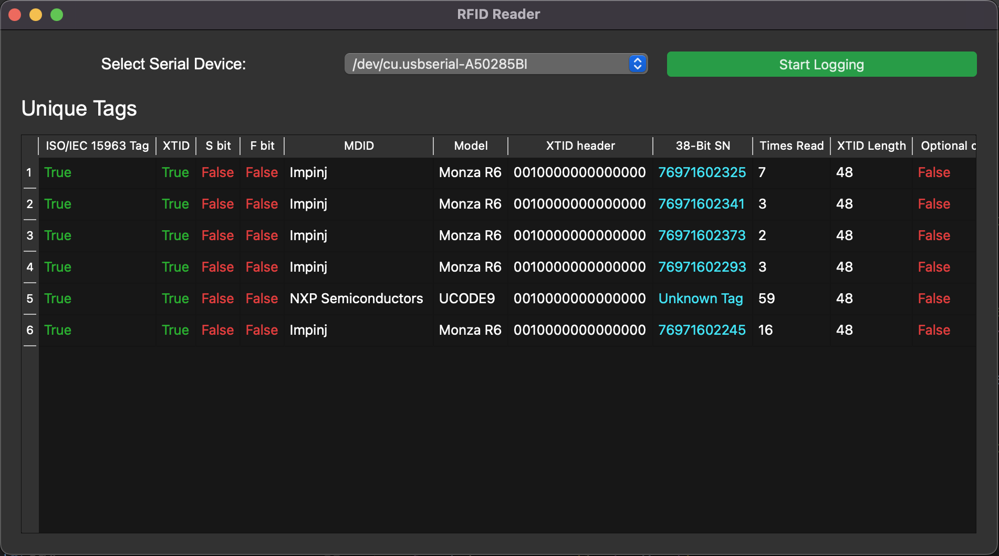

# Overview
This repo contains the python required to interface to the FM-503. This includes various modules that can be used in a command line setting as well as a GUI that can be used to display tag data and log to local or remote database

# The Hardware
The FM-503 module is an affordable (Less than $100) UHF RFID reader that is able to read ISO18000-6C / EPC GEN2 Tags. These readers come in may different form factors and can all be purchased on ali express. This software was develpoed to interface to [this development board](https://www.aliexpress.us/item/3256803639172556.html) but any FM-503 based board would work.

# Functions
So far, the following functions have been implemented:
1. Get reader DI
2. Get reader version number
3. Read the 69 bit TID bank
4. Decode TID bank based on the EPS Gen2 standard
5. Decode manufacturer ID and tag model number based on database provided by GS1
6. Display decoded TID data in a gui
